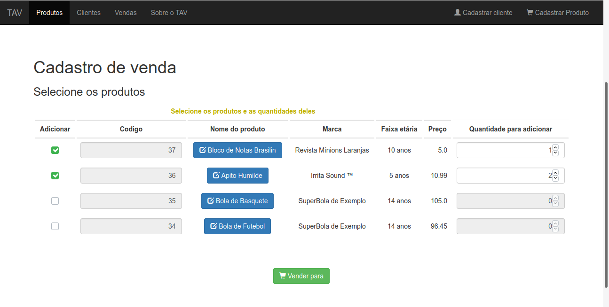

# Sistema para loja de brinquedos - FoiBrinks by Leshto
Projeto de sistema para loja de brinquedos, "FoiBrinks", com MVC, jQuery, Bootstrap e MariaDB como JDBC.

## Objetivo
Este é o meu atual projeto de sistema na UFERSA (Universidade Federal Rural do Semiárido), um projeto de Programação Web. A ideia é desenvolver um Terminal de Atendimento do Vendedor para registro de venda em uma única loja de brinquedos.

Existem capturas de tela para nos diretórios "docs/screenshots".

## O Terminal de Atendimento do Vendedor

